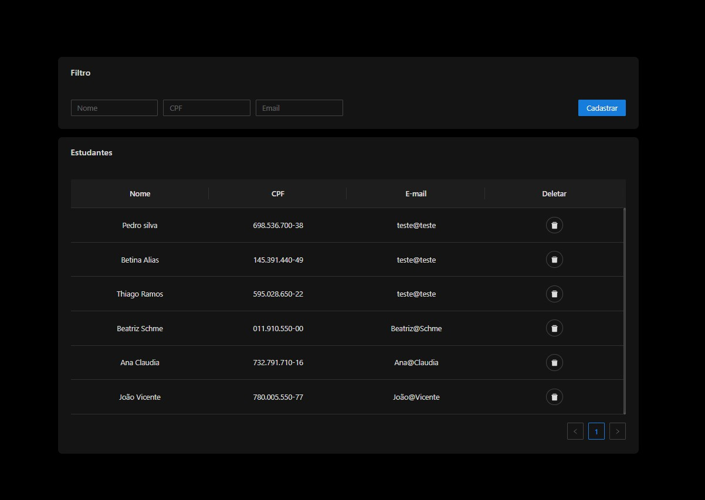

## Siga os passos abaixo para execução do projeto

- Clonar projeto para máquina local <br>
```https://github.com/rafaelkorz/graphql-API-with-docker.git```

- Na raiz do projeto **".../graphql-API-with-docker"** execute o comando <br>
```docker-compose up```

- Tela principal do sistema para cadastro de estudantes, visualização e filtros.


